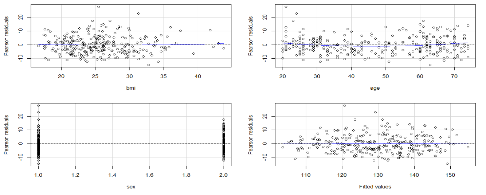

```{=tex}
\begin{center}
  {\huge \textbf{Ejercicio 1: Regresión lineal múltiple}}
\end{center}
```
La base de datos Preg1B.csv contiene información sobre 295 pacientes
seleccionados de forma aleatoria. Se desea analizar si existe una
asociación entre la presión arterial sistólica (bpsystol) y el índice de
masa corporal (bmi), en particular, si es posible observar que tener un
índice de masa corporal alto se asocia con una alta presión arterial
sistólica. Para realizar este análisis se indica que se considere el
sexo (sex: 1-hombre, 2-mujer) y la edad (age) de los pacientes, pues la
presión arterial sistólica podría variar de acuerdo con estos factores.

```{r, include=FALSE}
library(dplyr)
library(broom)
library(car)
library(ggplot2)
library(GGally)
library(latex2exp)
library(lmtest)
library(multcomp)
library(nortest)
library(purrr)
library(ggResidpanel)
```

```{r, include=FALSE}
#Importamos nuestros datos
datos<- read.csv("Preg1B.csv")
```

## Datos

Importamos nuestos datos y analizamos la relación de la presión arterial
sislotica con cada una de las covariables.

```{r scat_bpsystolbmi, fig.width=6, fig.height=2, echo=FALSE,fig.cap="\\label{fig:scat_bpsystolbmi}Relacion de los datos (bpsystol y bmi) ", message=FALSE, warning=FALSE, results='asis'}
datos1<- datos
datos1$sex=factor(datos$sex)

ggplot(datos1, aes(x = bmi, 
                  y = bpsystol, 
                  color = sex ,
                  shape = sex)) + 
  geom_point(size = 1.5) + 
  labs(title = "bpsystol v.s bmi",
       x = "bmi",
       y = "bpsystol") +
  scale_color_manual(values = c( "blue", "#FF3E96")) +
  theme_minimal()
```

Analizando datos en la Figura \ref{fig:scat_bpsystolbmi} podemos ver que
conforme van aumentando los valores del indice de masa corporal, van
aumentando los valores de la presión arterial sistolica, sin embargo se
hará un analisis aparte para argumentar a favor o en contra de es
afirmación.

```{r scat_bpsystolage, fig.width=6, fig.height=2, echo=FALSE, fig.cap="\\label{fig:scat_bpsystolage}Relacion de los datos (bpsystol y age)" , message=FALSE, warning=FALSE, results='asis'}
datos1<- datos
datos1$sex=factor(datos$sex)

ggplot(datos1, aes(x = age, 
                  y = bpsystol, 
                  color = sex ,
                  shape = sex)) + 
  geom_point(size = 1.5) + 
  labs(title = "bpsystol v.s age",
       x = "age",
       y = "bpsystol") +
  scale_color_manual(values = c( "blue", "#FF3E96")) +
  theme_minimal()
```

Analizando los datos en la Figura \ref{fig:scat_bpsystolbmi} , vemos que
la edad tambien tiene relación con la presion arterial sistolica, ya que
para ambos sexos, vemos un comportamiento creciente, es decir conforme
aumenta la edad de las personas, también aumenta su presión arterial
sistolica.

## I. Ajuste el modelo de regresión lineal múltiple para E(bpsystol; bmi,sex, age)

Tenemos que ajustar un modelo de regresión lineal multilple de la
siguiente forma
$$\mathbb{E}(y;bmi, age, sex) = \beta_0+ \beta_1 \cdot (bmi)+ \beta_2 \cdot (age) + \beta_3 \cdot (sex) $$

```{r, include=FALSE}
#Realizamos el ajuste de regresion lineal multiple
fit<- lm(bpsystol~bmi+age+sex, data= datos)
summary(fit) # Aquí se puede ver lo de la prueba de la tabla ANOVA
```

```{r, include=FALSE}
b_0<- fit$coef[1]
b_1<- fit$coef[2]
b_2<- fit$coef[3]
b_3<- fit$coef[4]
```

Por lo que la expresión del modelo ajustado de regresión lineal multiple
para E(bpsystol; bmi,sex, age) es

$$\mathbb{E}(bpsystol; bmi,sex, age) = `r b_0`+ `r b_1`\cdot (bmi)+ `r b_2`\cdot (age) `r b_3` \cdot (sex)$$

De acuerdo a los datos obtenidos, observamos que la prueba de hipotesis
referente a la tabla ANOVA, $H_0$ se rechaza, ya que el
$p-vale= 2.2e-16 < 0.05$ es decir que el modelo tiene sentido y que al
menos una de las variables explicativas (bmi, age o sex) aporta
información a nuestro modelo.

Ahora como nuestro objetivo es la estimación, es necesario realizar la
verificación de supuestos

Realizando la verificación de supuestos de nuestro primer modelo notamos
que:

**Linealidad**

```{r echo=TRUE}
#-------- LINEALIDAD---------------


#Se basa en el análisis de los residuales observados.
#incluyen un análisis por cada variable incluida en 
#el modelo

#Podemos identificar patrones en cada variable

par(mfrow=c(1,1))
residualPlots(fit)

#Notemos que a simple vista no se encontró algun patron que
# nos de indicio a pensar que el supuesto de liealidad no se 
#cumple

#Ahora con las pruebas de Hipotesis, notamos que en todas, el 
#p-value es mayor a la significancia, por lo que 
# no encontramos evidencia en contra del supuesto de linealidad

```

Para verificar el supuesto de linealidad, se usaron dos metodos, uno
mediante un metodo grafico, donde y mediante pruebas de hipotesis. Con
base a estos metodos concluimos que no se encontró evidencia en contra
del supuesto de linealidad, analizando las graficas podemos ver que a
simple vista no se encontró algun patron que nos de indicio a pensar que
el supuesto de linealidad no se cumple, además en las pruebas de
hipotesis en todas (tanto en la linealidad general como en la linealidad
por cada covariable), el p-value es mayor a la significancia, por lo que
no encontramos evidencia en contra del supuesto de linealidad.

**Homocedasticidad**

Hacemos la prueba de hipotesis donde se contrasta: H_0: la varianza es
constante vs H_a: la varianza depende

```{r, include =FALSE}
##############################
#Supuesto de homocedasticidad#
##############################

#Hacemos la prueba de hipotesis donde se contrasta:
#H_0: la varianza es constante vs H_a: la varianza depende 

#lo que se busca es no encontrar evidencia en contra de $H_0$
  
#Notemos que en todas las pruebas el p-value es mayor a la significancia por 
#lo que sería plaucible decir que no se encontró evidencia en contra del supuesto de homocedasticidad

car::ncvTest(fit)
# qué variable en particular está asociada con la varianza
car::ncvTest(fit,~bmi) #Homocedasticidad en la variable bmi
car::ncvTest(fit,~age) #Homocedasticidad en la variable age
car::ncvTest(fit,~sex) #Homocedasticidad en la variable sex
#Sin embargo, para las otras pruebas, la hipotesis nula se rechaza, 
#ya que el p-value es menor a la significancia.

#notemos tambien que se encontró que la variable age es la que está 
#asociada con la varianza :c

```

Para la prueba de hipotesis global o general de modelo, se obtuvo un
$p-value=0.016013<0.05$ por lo que se rechaza $H_0$ Para las pruebas de
hipotesis individuales, tenemos que para la covariable "age",
$p-value=0.0073463 < 0.05$ por lo que tambien encontramos evidencia en
contra de este supuesto para esta covariable. Para el supuesto de
homocedasticidad tenemos que encontramos evidencia en contra del
supuesto de homocedasticidad, es decir que la varianza depende y no es
constante, además las pruebas nos dicen que la variable que está
asociada con la varianza es la varible "age".

**Normalidad**

Para verificar el supuesto de normalidad, realizaremos pruebas de
hipotesis donde se contraste lo siguiente:

$H_0$: los datos provienen de la distribucion normal vs $H_a$: los datos
**NO** provienen de la distribución normal

```{r, include=FALSE}
#Para verificar el supuesto de normalidad, realizaremos pruebas de 
#hipotesis donde se contraste lo siguiente:
  
#H_0: los datos provienen de la distribucion normal vs 
#H_a los datos NO provienen de la distribución normal

Datosfit=augment(fit)
shapiro.test(Datosfit$.std.resid)
nortest::lillie.test(Datosfit$.std.resid)


#Notemos que en ambas pruebas el p-value es menor a la 
#significancia por lo que encontramos evidencia en contra 
#del supuesto de normalidad

#ademas podemos analizar este supuesto graficamente mediante la QQ-plot, en donde se espera que la mayoría de los datos formen una recta con una pendiente de 45 grados.
plot(fit, 2)
```

Al realizar las dos pruebas de hipotesis, primero usando "Shapiro-Wilk
normality test", se obtiene un $p-value = 0.0009943<0.05$, ahora usando
"Lilliefors (Kolmogorov-Smirnov) normality test" se obtiene un
$p-value = 0.01641<0.05$ Con base a los resultados de las pruebas de
hipotesis, el p-value es menor a la significancia por lo que encontramos
evidencia en contra del supuesto de normalidad, de igual forma con
graficamente, los datos parecen no ajustarse a la recta.

Algunas conclusiones de la verificación de supuestos

Se encontró evidencia en contra del supuesto de homocedasticidad y de
normalidad por lo que el modelo no es adecuado y optaremos por realizar
transformaciones a las variables o realizar una regresión ponderada.

# II. Tranformación de variables

Dado que no se cumple el supuesto de homocedasticidad, es necesario
hacer una tranformación en las variables, un camino rapido seria
transformar la variable "bpsystol", sin embargo tendriamos un tema con
la interpretación si es que lo que queremos hacer es en terminos de la
media, por lo que tomaremos el camino de la regresión ponderada.

```{r, include = FALSE}
# Lo que realizaremos es encontrar los pesos por medio de 
#mallas y seleccionaremos el modelo que tenga un valor menor en el AIC

# Usando map
# Primero vamos a buscar sólamente uno de los posibles pesos
# Dado que la varianza aumenta con la x, podemos buscar un peso de la forma 1/(x^l), para alguna l>0
posib_pot <- seq(0.1,3,by=.1)

# Entonces, nosotros simplemente aplicamos lo que ya conocemos, la función map, con una función que devuelva valores

aic <- map(.x = posib_pot, .f= function(.x){
  AIC(lm(bpsystol~bmi+age+sex, data = datos, weights = 1/(age)^.x))
})

#Pero como es más fácil trabajar con vectores, y "AIC" es una lista, lo volvemos vector
aic <- unlist(aic)

#Buscamos el mínimo, y con ese trabajaremos a continuación
#Sin embargo, guardaremos 3 diferentes opciones, para buscar el que mejor funcione
elegida <- which.min(aic)
elegida2 <- which.min(aic[-elegida])
elegida3 <- which.min(aic[-elegida][-elegida2])

potencia1 <- posib_pot[elegida]
potencia2 <- posib_pot[-elegida][elegida2]
potencia3 <- posib_pot[-elegida][-elegida2][elegida3]
```

```{r, include=FALSE}
# Modelo de Regresión lineal multiple ponderada
fit2<-lm(bpsystol~bmi+age+sex, data = datos, weights = 1/(age)^potencia1)
```

Con base a lo que se obtuvo en la regresión ponderada, el modelo con
menor AIC, fue

$$\mathbb{E}(bpsystol; bmi, age, sex)= \beta_0+ \beta_1 \cdot (bmi)+ \beta_2 \cdot (age) + \beta_3 \cdot (sex)$$

con peso: $1/age^{0.5}$

Ahora es necesario saber si este modelo cumple con los supuestos

**Linealidad**

Vemos de acuerdo a los metodos para verificar el supuesto de linealidad
(graficas y pruebas de hipotesis) se puede concluir que el supuesto de
linealidad se sigue cumpliendo de forma global y por cada covariable.
\newpage

```{r, include=FALSE}
#____Supuesto de linealidad

residualPlots(fit2)

#Notemos que a simple vista, guiandonos por las graficas, se sigue
# cumpliendo el supuesto de linealidad
```

```{r lin,  echo=FALSE,out.width="205px", fig.cap="Grafica para verificar supuesto de linealidad",fig.align="center", message=FALSE, warning=FALSE}

```

Con base en la Figura \ref{fig:lin} a simple vista no se encontró algun
patron que nos de indicio a pensar que el supuesto de liealidad no se
cumple

**Homocedasticidad** Hacemos la prueba de hipotesis donde se contrasta:
H_0: la varianza es constante vs H_a: la varianza depende

```{r, include=FALSE}
#Supuesto de homocedasticidad**

car::ncvTest(fit2)
car::ncvTest(fit2,~bmi)
car::ncvTest(fit2,~age)
car::ncvTest(fit2,~sex)

```

Realizando las pruebas de hipotesis, tanto para la prueba de hipotesis
global o general de modelo, como las pruebas de hipotesis individuales
de cada covariable se obtuvo que el p-value es mayor a la significancia
por lo que sería plaucible decir que no se encontró evidencia en contra
del supuesto de homocedasticidad.

**Normalidad**

Para verificar el supuesto de Normalidad, tambien podemos hacerlo
mediante la QQ-plot

```{r qqplot, fig.width=4, fig.height=3, echo=FALSE, fig.cap="\\label{fig:qqplot}QQ-plot para verificar supuesto de normalidad", message=FALSE, warning=FALSE, results='asis'}
#lo compobaremos graficamente mediante la QQ-plot, en donde se espera que la mayoría de los datos formen una recta con una recta
plot(fit, 2)
```

Con base en la Figura \ref{fig:qqplot} la mayoria de los datos parecen
formar una linea recta, por lo que podriamos decir que se cumple el
supuesto de normalidad

En conclusión este modelo de regresión lineal multiple ponderada cumple
con los supuestos.

```{r, include=FALSE}
b0<- fit2$coef[1]
b1<- fit2$coef[2]
b2<- fit2$coef[3]
b3<- fit2$coef[4]
```

Por lo que la expresión del modelo ajustado de regresión lineal multiple
ponderada para E(bpsystol; bmi,sex, age) es

$$\mathbb{E}(bpsystol; bmi,sex, age) = `r b0`+ `r b1`\cdot (bmi)+ `r b2`\cdot (age) `r b3` \cdot (sex)$$

## III. ¿Se puede indicar que para una persona de cierta edad y sexo, tener un índice de masa corporal alto se asocia con una alta presión arterial sistólica?

Lo que quiere decir es que para cualquier persona de cualquier sexo,
entre más aumente la masa corporal, la persión arterial sistolica
tambien aumentará, lo que lo podemos traducir a

si fijamos la edad a un valor $x$ y al sexo a una variable tipo $k$ y
sea $a>b$ entonces se debe cumplir:

$$\mathbb{E}(bpsystol; bmi=a, age=x, sex=k)>\mathbb{E}(bpsystol; bmi=b, age=x, sex=k)$$
$$\beta_0+ \beta_1 \cdot (a)+ \beta_2 \cdot (x) + \beta_3 \cdot (k)>\beta_0+ \beta_1 \cdot (b)+ \beta_2 \cdot (x) + \beta_3 \cdot (k)$$
$$ \beta_1 \cdot (a)> \beta_1 \cdot (b) \Longrightarrow \beta_1 \cdot (a)- \beta_1 \cdot (b)> 0 \Longrightarrow \beta_1 \cdot (a-b)> 0$$

Como $a>b \Longrightarrow a-b>0$

Entonces para que se cumpla la afirmación "tener un índice de masa
corporal alto se asocia con una alta presión arterial sistólica",
necesitamos que $b_1>0$

Entonces se realizara la prueba de hipotesis (Ponemos lo que nos
interesa en la hipotesis alternativa para acotar el error tipo 2)

$$H_0: \beta_1\leq0 ~~~v.s~~~ H_a: \beta_1>0$$

```{r, include=FALSE}
mat<- matrix(c(0,1,0,0), ncol=4, nrow=1, byrow=TRUE)
c<- 0
summary(glht(fit2, 
             linfct=mat, 
             rhs=c, 
             alternative = "greater"))
```

Podemos ver que el $p-value=1.14e-09< 0.05$ es menor a la significancia,
por lo que se rechaza $H_0$, es decir encontramos evidencia en contra de
$\beta_1\leq0$, por lo que sería plaucible decir que $\beta_1>0$, es
decir que la afirmación "tener un índice de masa corporal alto se asocia
con una alta presión arterial sistólica" es cierta.

## IV. Estimación puntual

La expresión del modelo ajustado de regresión lineal multiple ponderada
para E(bpsystol; bmi,sex, age) es

$$\mathbb{E}(bpsystol; bmi,sex, age) = `r b0`+ `r b1`\cdot (bmi)+ `r b2`\cdot (age) `r b3` \cdot (sex)$$

```{r EstimPunt, fig.width=7, fig.height=4, echo=FALSE, fig.cap="\\label{fig:EstimPunt}Estimación puntual asociada a la relación entre bpsystol y bmi, para edades 30, 50 y 64", message=FALSE, warning=FALSE, results='asis'}

par(mfrow=c(1,3)) 

Estim<-function(X1){ b0+b1*X1+b2*(30)+ b3*1}
curve(Estim, from = min(datos$bmi), to = max(datos$bmi),
      col = "blue",  xlab = TeX("$X=bmi$"), ylab=TeX("$bpsystol$"),main = "30 años")
Estim<-function(X1){ b0+b1*X1+b2*(30)+ b3*2}
curve(Estim, from = min(datos$bmi), to = max(datos$bmi),
      col = "#B03060",add= T)
l <- expression(paste("Hombre"), paste("Mujer"))
legend("bottomright", legend = l, lty = c(1, 1), bty = "n", col = c("blue", "#B03060"), inset = .02, y.intersp = .75)
grid()
# 50 añop
Estim<-function(X1){ b0+b1*X1+b2*(50)+ b3*1}
curve(Estim, from = min(datos$bmi), to = max(datos$bmi),
      col = "blue",  xlab = TeX("$X=bmi$"), ylab=TeX("$bpsystol$"),main = "50 años")
Estim<-function(X1){ b0+b1*X1+b2*(50)+ b3*2}
curve(Estim, from = min(datos$bmi), to = max(datos$bmi),
      col = "#B03060",add= T)
l <- expression(paste("Hombre"), paste("Mujer"))
legend("bottomright", legend = l, lty = c(1, 1), bty = "n", col = c("blue", "#B03060"), inset = .02, y.intersp = .75)
grid()

# 64 años
Estim<-function(X1){ b0+b1*X1+b2*(64)+ b3*1}
curve(Estim, from = min(datos$bmi), to = max(datos$bmi),
      col = "blue",  xlab = TeX("$X=bmi$"), ylab=TeX("$bpsystol$"),main = "64 años")
Estim<-function(X1){ b0+b1*X1+b2*(64)+ b3*2}
curve(Estim, from = min(datos$bmi), to = max(datos$bmi),
      col = "#B03060",add= T)
l <- expression(paste("Hombre"), paste("Mujer"))
legend("bottomright", legend = l, lty = c(1, 1), bty = "n", col = c("blue", "#B03060"), inset = .02, y.intersp = .75)
grid()
```

En la Figura \ref{fig:EstimPunt} se puede observar que para las edades
observadas (30, 50 y 64) la presión arterial sistólica va creciendo
conforme el índice de masa corporal (bmi) va aumentando, este
comportamiento sucede para ambos sexos (Femenino y masculino). Ademas es
evidente en las 3 graficas que la presión arterial sistólica es mayor en
hombres que en mujeres ya que la recta de los hombres (color azul)
siempre está por arriba de la recta de las mujeres (color rosa).

Finalmente podemos concluir que al ajustar un modelo de regresión lineal
multiple ponderado, pudimos verificar por medio de pruebas de hipotesis
que a medida que aumenta el indice de masa corporal de cualquier persona
(de cualquer sexo y cualquier edad), la presion arterial sistolica igual
aumenta, tambien graficamente se observó que la la presión arterial
sistólica es mayor en hombres que en mujeres, además la presión arterial
sistolica, va aumentando conforme va aumentando la edad de la persona.
