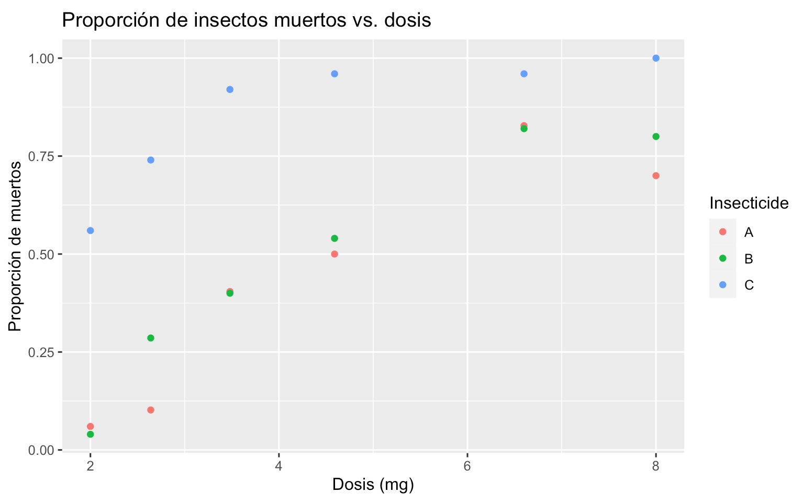
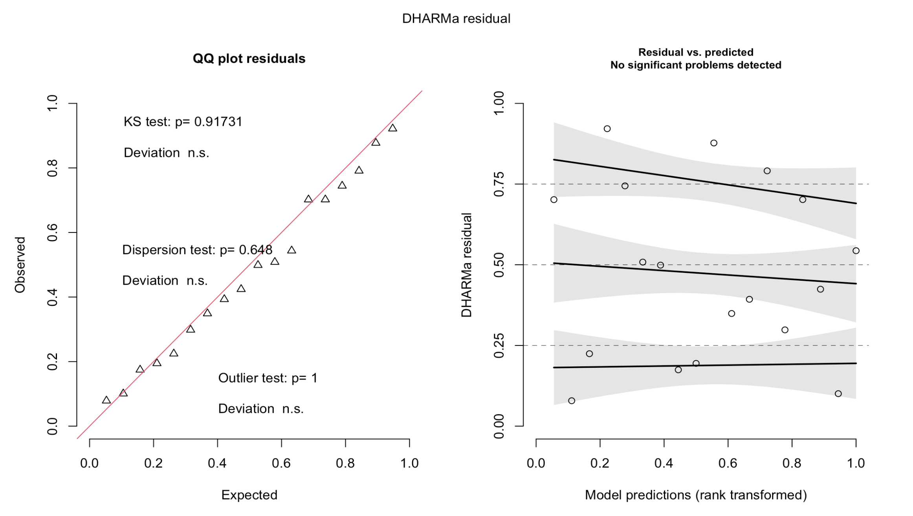
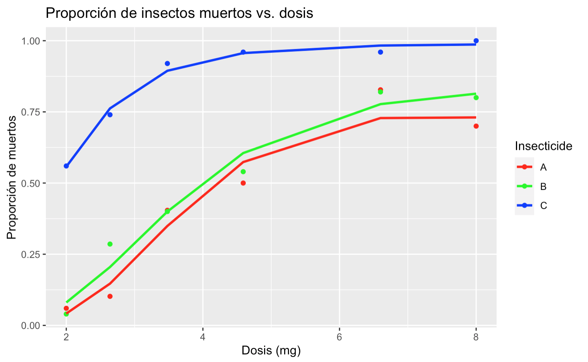
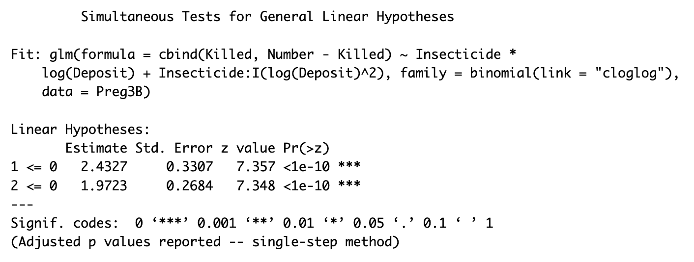
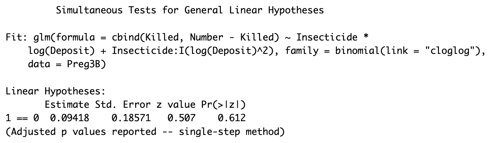

```{=tex}
\setcounter{figure}{7}
\setcounter{table}{2}
```
```{r setup, include=FALSE}

rm(list = ls(all.names = TRUE))
gc()

# Configuración global de los bloques de código (chunk's)
knitr::opts_chunk$set(echo = FALSE,
                      fig.align = "center",
                      fig.pos = "H", 
                      fig.dim = c(4.24,2.24))
# Librerías
library(dplyr)      # Para el manejo de datos
library(ggplot2)    # Para realizar gráficas
library(DHARMa)
library(vcd)
library(knitr)
library(kableExtra)
library(multcomp)
library(emmeans)
```

# Modelos lineales generalizados para datos binarios

La base de datos Preg3B.csv contiene información sobre 862 insectos que fueron expuestos a diferentes dosis (Deposit, mg) de tres insecticidas (Insecticide). La asignación a una dosis y al tipo de insecticida se realizó de forma aleatoria. Después de seis días se analizó si los insectos se habían muerto, de manera que la base de datos contiene también el número de insectos muertos (Killed) y el número total de insectos expuestos (Number) por cada dosis e insecticida. Dado que se asume que el costo de los insecticidas es el mismo, el objetivo del análisis es identificar para cada insecticida qué dosis es la mínima con la que se puede indicar que el 70 % de los insectos se muere, así como si considerando la menor de esas tres dosis se puede afirmar que un insecticida es el mejor comparado con el resto.

```{r Datos, include=FALSE}

# Cargamos la base de datos y transformamos a factor la variable categórica
Preg3B <- read.csv("Preg3B.csv")
Preg3B$Insecticide <- as.factor(Preg3B$Insecticide)
```

### 3.1 Visualización de Datos

Para analizar y visualizar los datos de mejor manera, procederemos a realizar una gráfica de dispersión donde podamos ver la proporción de insectos muertos por cada combinación de dosis-insecticida.

```{r Scatterplot, fig.cap="Proporción", include=FALSE}
#i. Gráfica de dispersión
library(ggplot2)
graf1<-ggplot(Preg3B, aes(x=Deposit, y=Killed/Number, color=Insecticide)) +
  geom_point() + 
  ggtitle("Proporción de insectos muertos vs. dosis") +
  xlab("Dosis (mg)") + ylab("Proporción de muertos")
graf1
# Se observa que la proporción de muertos aumenta con la dosis para los 3 insecticidas
```

```{r scatter, echo=FALSE, out.width="205px", fig.cap="Proporción de insectos muertos por dosis de insecticida según su tipo (A, B o C)"}

```

Notemos que en la grafica \@ref(fig:scatter), se puede observar que para todos los insecticidas (A,B y C), a mayor dosis, hay mayor proporción de insectos muertos. Sin embargo, es importante destacar cómo, con la misma cantidad de dosis para los tres tipos de insecticidas, hay una mayor proporción de insectos muertos con el insecticida tipo C; los insecticidas A y B parecen tener un comportamiento similar.

### Ajuste de Modelos

### 3.2 Modelos con interacción

Ajustamos los tres modelos indicados en el inciso ii) con las siguientes ligas: *logit, probit y cloglog.\
*

Modelos:

-   fit1 \<- glm(cbind(Killed, Number-Killed) \~ Insecticide\*log(Deposit), data = Preg3B, family = binomial(link="logit"))

-   fit2 \<- glm(cbind(Killed, Number-Killed) \~ Insecticide\*log(Deposit), data = Preg3B, family = binomial(link="probit"))

-   fit3 \<- glm(cbind(Killed, Number-Killed) \~ Insecticide\*log(Deposit), data = Preg3B, family = binomial(link="cloglog"))

```{r modelos1, echo=FALSE}
#Para mostrar interacciones utilizamos un * que significa todas las interaciones entre las
#variables Insecticide y log(Deposit)
#Procedemos a ajustar los tres modelos planteados anteriormente con las ligas mencionadas:
fit1 <- glm(cbind(Killed, Number-Killed) ~ Insecticide*log(Deposit),  
          data = Preg3B, family = binomial(link="logit"))
fit2 <- glm(cbind(Killed, Number-Killed) ~ Insecticide*log(Deposit), 
            data = Preg3B, family = binomial(link="probit"))
fit3 <- glm(cbind(Killed, Number-Killed) ~ Insecticide*log(Deposit), 
            data = Preg3B, family = binomial(link="cloglog"))
```

#### Componente lineal según el tipo de insecticida:

Notemos que ya que para todos estamos haciendo el modelo con interacciones y que tomaremos a el Insecticida A como el nivel de referencia, de forma general, el componente lineal se verá de la siguiente manera:

$$
\eta=\eta(\beta, x_i)= \beta_0+ \beta_1 \mathbbm{1}_{Inseticide=B}+\beta_2 \mathbbm{1}_{Inseticide=C}+\beta_3 ln(D)+\beta_4 ln(D)\mathbbm{1}_{Inseticide=B}+\beta_5 ln(D)\mathbbm{1}_{Inseticide=C}
$$

Ahora, ya que tenemos la expresión general para los tres modelos (tomando como nivel de referencia a el insecticida A), expresaremos el componente lineal para cada Insecticida en \@ref(tab:tab):

```{r tab, echo=FALSE, message=FALSE, warning=FALSE}
Insecticida<-c('$\\eta_{Insecticide=A}$','$\\eta_{Insecticide=B}$', '$\\eta_{Insecticide=C}$')
CL<- c('$\\beta_0+\\beta_3 ln(D)$','$\\beta_0+\\beta_1+\\beta_3 ln(D)+\\beta_4 ln(D)=(\\beta_0+\\beta_1)+ln(D)(\\beta_3+\\beta_4)$', '$\\beta_0+\\beta_2+\\beta_3 ln(D)+\\beta_5 ln(D)=(\\beta_0 + \\beta_2)+ln(D)(\\beta_3+\\beta_5)$')
df<-data_frame(Insecticida, "Componente Lineal"=CL)
kable(df,"latex", align = "c", booktabs=T, escape = F, caption="Tabla donde se muestra su componente lineal según el tipo de insecticida (A, B o C)") %>%
  kable_styling(latex_options = "HOLD_position")
```

Observemos que lo único que hay que hacer para obtener el componente lineal según el tipo de insecticida para cada uno de los **modelos**, es sustituir los correspondientes valores de $\beta_i$ (los cuales se obtienen del *Estimate* de la función ***summary()***) en la expresión que deseen obtener en la tabla \@ref(tab:tab)

#### Comparación de modelos:

Compararemos los modelos por medio del criterio AIC y elegiremos el que tenga asociado el valor más pequeño:

```{r aics, echo=FALSE, message=FALSE, warning=FALSE}
AIC1<-c(AIC(fit1), AIC(fit2), AIC(fit3))
Modelo<-c("Modelo 1: Liga Logit", "Modelo 2: Liga Probit", "Modelo 3: Liga cloglog")
df2<-data_frame(Modelo, "AIC"=AIC1)
kable(df2, align = "c", booktabs=T, escape = F, caption="Tabla comparativa de AIC") %>%
  kable_styling(latex_options = "HOLD_position")
```

Podemos ver en la tabla \@ref(tab:aics), que el menor AIC lo tiene el **modelo 2**, que es el **modelo con interacciones** y **liga *probit,*** por lo cual, pensamos que es el más adecuado.

Sin embargo, haremos el análisis de otros tres modelos para ver si encontramos uno que se adapte mejor a nuestros datos.

### 3.3 Modelos con la interacción anterior + Insecticide : I(ln(Deposit)\^2)

Procedemos a ajustar los modelos presentados anteriormente, con la diferencia de que le agregaremos la interacción de Insecticide con (ln(Deposit))\^2, es decir:

-   fit4 \<- glm(cbind(Killed, Number-Killed) \~ Insecticide\*log(Deposit) + Insecticide:I(log(Deposit)\^2), data=Preg3B, family=binomial(link="logit"))

-   fit5 \<- glm(cbind(Killed, Number-Killed) \~ Insecticide\*log(Deposit) + Insecticide:I(log(Deposit)\^2), data=Preg3B, family=binomial(link="probit"))

-   fit6 \<- glm(cbind(Killed, Number-Killed) \~ Insecticide\*log(Deposit) + Insecticide:I(log(Deposit)\^2), data=Preg3B, family=binomial(link="cloglog"))

```{r modelos2, echo=FALSE}
#Para mostrar interacciones utilizamos un * que significa todas las interaciones entre las
#variables Insecticide y log(Deposit)
#Procedemos a ajustar los tres modelos anteriores más la interacción mencionada: 
fit4 <- glm(cbind(Killed, Number-Killed) ~ Insecticide*log(Deposit) + 
           Insecticide:I(log(Deposit)^2), data=Preg3B, family=binomial(link="logit"))
fit5 <- glm(cbind(Killed, Number-Killed) ~ Insecticide*log(Deposit) + 
           Insecticide:I(log(Deposit)^2), data=Preg3B, family=binomial(link="probit"))
fit6 <- glm(cbind(Killed, Number-Killed) ~ Insecticide*log(Deposit) + 
           Insecticide:I(log(Deposit)^2),data=Preg3B, family=binomial(link="cloglog"))
```

#### Componente lineal según el tipo de insecticida:

Sabemos que, la expresión general del componente lineal para los tres modelos (tomando como nivel de referencia a el insecticida A) es:

$$
\eta=\eta(\beta, x_i)= \beta_0+ \beta_1 \mathbbm{1}_{Inseticide=B}+\beta_2 \mathbbm{1}_{Inseticide=C}+\beta_3 ln(D)+\beta_4 ln(D)\mathbbm{1}_{Inseticide=B}+\beta_5 ln(D)\mathbbm{1}_{Inseticide=C}
$$

$$
+\beta_6ln(D)^2\mathbbm{1}_{Inseticide=A}+ \beta_7ln(D)^2\mathbbm{1}_{Inseticide=B}+ \beta_8ln(D)^2\mathbbm{1}_{Inseticide=C}
$$

Ya que tenemos la expresión general para los tres modelos (tomando como nivel de referencia a el insecticida A), expresaremos el componente lineal para cada Insecticida en \@ref(tab:tab1):

```{r tab1, echo=FALSE, message=FALSE, warning=FALSE}
Insecticida<-c('$\\eta_{Insecticide=A}$','$\\eta_{Insecticide=B}$', '$\\eta_{Insecticide=C}$')
CL<- c('$\\beta_0+\\beta_3 ln(D)+\\beta_6 ln(D)^2$',
        '$\\beta_0+\\beta_1+\\beta_3 ln(D)+\\beta_4 ln(D)+\\beta_7 ln(D)^2=
       (\\beta_0+\\beta_1)+ln(D)(\\beta_3+\\beta_4)+\\beta_7 ln(D)^2$',
       '$\\beta_0+\\beta_2+\\beta_3 ln(D)+\\beta_5 ln(D)+\\beta_8 ln(D)^2=
       (\\beta_0 + \\beta_2)+ln(D)(\\beta_3+\\beta_5)+\\beta_8 ln(D)^2$')
df<-data_frame(Insecticida, "Componente Lineal"=CL)
kable(df,"latex", align = "c", booktabs=T, escape = F, caption="Tabla donde se muestra su componente lineal según el tipo de insecticida (A, B o C)") %>%
  kable_styling(latex_options = "HOLD_position")
```

#### Comparación y selección de modelo:

Tomaremos el AIC más pequeño de los primeros 3 modelos, el cual fue el del **modelo 2**, y lo compararemos con los AIC de los **modelos 4, 5 y 6**, para ver si tuvo un efecto el haber agregado la interacción Insecticide : I(ln(Deposit\^2)) a los primeros modelos que se realizaron.

```{r aics2, echo=FALSE, message=FALSE, warning=FALSE}
AIC2<-c(AIC(fit2), AIC(fit4), AIC(fit5), AIC(fit6))
Modelo2<-c("Modelo 2", "Modelo 4", "Modelo 5", "Modelo 6")
df4<-data_frame("Modelo"=Modelo2, "AIC"=AIC2)
kable(df4, align = "c", booktabs=T, escape = F, caption="Tabla comparativa de AIC") %>%
  kable_styling(latex_options = "HOLD_position")
```

Vemos en el cuadro \@ref(tab:aics2), que sí hubo una mejora en el AIC agregando $Insecticide : I(ln(Deposit)^2)$ a los modelos originales, por lo tanto, el mejor AIC de los 6 modelos realizados fue el **modelo 6,** y es el que ocuparemos de ahora en adelante.

Veamos si cumple los supuestos:

### Verificación de Supuestos

```{r hipotesis, include=FALSE}
library(DHARMa)  #Los residuales simulados también son útiles en este caso
set.seed(123)
fit6tres <- simulateResiduals(fittedModel = fit6)
plot(fit6tres)
```

```{r fig1, echo=FALSE, out.width="225px", fig.cap="Graficas para analizar los supuestos del modelo 6 (fit 6)"}


```

A partir de la figura \@ref(fig:fig1), parece no haber evidencia en contra de los supuestos, ya que en la primer gráfica no se encuentran problemas con el componente aleatorio y la función liga y, lo mismo para la segunda, tampoco se presentan problemas en el componente lineal.

Por lo que, podemos utilizar nuestro modelo para resolver el ***inciso iv)***

a)  Observemos la siguiente gráfica:

```{r pred, warning=TRUE, include=FALSE}

# Predecir las probabilidades usando el modelo
prediccion <- predict(fit6, type = "response")
Preg3B2<-data_frame(Preg3B, prediccion)
```

```{r Estpunt, fig.cap="Estimaciones", include=FALSE}
# Agregar las predicciones a la gráfica
graf2 <- ggplot(Preg3B2, aes(x=Deposit, y=Killed/Number, color=Insecticide)) +
  geom_point() + 
  ggtitle("Proporción de insectos muertos vs. dosis") +
  xlab("Dosis (mg)") + ylab("Proporción de muertos") +
  geom_line(aes(y = prediccion), linewidth = 1) +
  scale_color_manual(values = c("A" = "red", "B" = "green", "C" = "blue"))
graf2
```

```{r fig2, echo=FALSE, out.width="205px", fig.cap="Estimaciones puntuales para cada insecticida (A, B y C)"}

```

Notemos que en \@ref(fig:fig2), podemos ver como cómo para los tres tipos de insecticida, a mayor dosis, mayor es la proporcón de insectos muertos. También observemos que las estimaciones puntuales sugieren que el insecticida C es el más efectivo, seguido por B y luego A, donde la línea del insecticida C estima las mayores proporciones de insectos muertos en comparación con A y B.

b)  Ahora, calculemos la dosis mínima para cada insecticida con la que se puede indicar que el 70% de los insectos muere:

Recordemos que lo único que tenemos que hacer es sustituir en la liga, que en este caso es la *clolog,* $\mu_i=0.7$, después, igualamos la liga con el componente lineal para cada insecticida que se encuentra en el cuadro \@ref(tab:tab1), y finalmente, despejamos $D=Deposit$ de la ecuación.

A continuación, los resultados de la dosis mínima para cada insecticida:

```{r dosis min, echo=FALSE}
 prob <- 0.7
liga <- log((-log(1-prob)))
#dosis_a se obtiene igualando liga=componente lineal del insecticida a, para despues despejar D
dosis_a <- c(exp((8.139 - sqrt(0.82618812)) / 4.0876),exp((8.139 + sqrt(0.82618812)) / 4.0876))
#dosis_b se obtiene igualando liga=componente lineal del insecticida b, para despues despejar D
dosis_b <- c(exp((5.8211 - sqrt(1.87497793)) / 2.6388),exp((5.8211 + sqrt(1.87497793)) / 2.6388))
#dosis_c se obtiene igualando liga=componente lineal del insecticida c, para despues despejar D
dosis_c <- c(exp((3.2953 - sqrt(3.88064)) / 1.5096),exp((3.2953 + sqrt(3.88064)) / 1.5096))
#dosis minimas
dosis_min_a <- min(dosis_a)
dosis_min_b <- min(dosis_b) 
dosis_min_c <- min(dosis_c)

```

```{r doseinsec, echo=FALSE}
#Ponemos en una tabla las dosis minimas de cada insecticida
dosis_mins <- c(dosis_min_a, dosis_min_b, dosis_min_c)
insecticidas_c <- c("Insecticida A", "Insecticida B", "Insecticida C")
df_dosis_mins <- data_frame("Insecticidas"=insecticidas_c, "Dosis mínimas para que el 70% de los insectos muera"=dosis_mins)
kable(df_dosis_mins, align = "c", caption = "Dosis mínimas para el 70 por ciento de mortalidad según el insecticida") %>%
  kable_styling(latex_options = "HOLD_position")
```

Analizando la tabla \@ref(tab:doseinsec), podemos ver como el Insecticida C es el que necesita una menor dosis para que mueran el 70% de lo insectos, donde le sigue el Insecticida B, y finalmente el A, con la mayor dosis mínima.

c)  Ya que, la menor dosis se obtuvo del Insecticida C, además que las gráficas presentadas en este problema nos muestran que, al parecer, el Insecticida C tiene un mejor desempeño sobre A y B, por lo que, realizaremos la siguiente prueba simultánea para ver si en efecto, C tiene un mejor desepeño que los otros dos insecticidas, por lo que, realizaremos la siguiente prueba:

```{r prueba1, warning=FALSE, include=FALSE}
#Escribimos nuestras pruebas
K1=matrix(c(0,0,1,0,0,log(2.405),-((log(2.405))^2), 0,(log(2.405))^2, #C>A
         0,-1,1,0,-(log(2.405)),log(2.405),0,-((log(2.405))^2),(log(2.405))^2), #C>B
         ncol=9, nrow=2, byrow=TRUE)
#Definimos nuestro vector m
m1=c(0,0)

#Finalmente realizamos nuestra prueba con la misma función glht, sin embargo, ahora le añadimos un parámetro, que es la alternativa, previamente no la habiamos utilizado, pues por defecto esta la prueba de dos colas (igual contra diferente), ahora le ponemos la dirección que es greater

#Y para obtener la información,nuevamente utilizamos el summary
summary(glht(fit6, linfct=K1, rhs=m1, alternative="greater"))
```

```{r fig3, echo=FALSE, out.width="222px", fig.cap="Prueba de hipótesis simultáneas"}

```

Podemos ver en \@ref(fig:fig3) que, en efecto, dado que en ambos casos se rechazan las hipótesis nulas ($H_0$), se puede concluir que el insecticida C es significativamente mejor (mata más insectos) que los insecticidas A y B, según los datos y el modelo utilizado, también los valores positivos de los estimados corroboran que el efecto de C es mayor.

d)  Ya que sabemos que C tiene mejor desempaño que A y B, ¿podemos ver si A y B tiene un desempeño similar?

Realicemos la siguiente prueba de hipótesis:

```{r prueba2, warning=FALSE, include=FALSE}
#Escribimos nuestra prueba y tomamos un promedio de las dosis entre A y B
K2=matrix(c(0,1,0,0,log(5.63),0,-((log(5.63))^2),(log(5.63))^2,0), #Insecticida B = Insecticida A
         ncol=9, nrow=1, byrow=TRUE)
#Definimos nuestro vector m
m2=c(0)
#Finalmente realizamos nuestra prueba con la misma función glht

#Y para obtener la información,nuevamente utilizamos el summary
summary(glht(fit6, linfct=K2, rhs=m2))
```

```{r fig4, echo=FALSE, out.width="222px", fig.cap="Prueba de hipótesis simultánea sobre contrastes definidos"}

```

Podemos ver en \@ref(fig:fig4), que **no se rechaza** $H_0$, por lo que podemos decir que los insecticidas A y B presentan un desempeño estadísticamente similar, puesto que no hay evidencia suficiente de que los Insecticidas A y B tengan efectos diferentes (en cuanto a la variable respuesta de insectos muertos).
