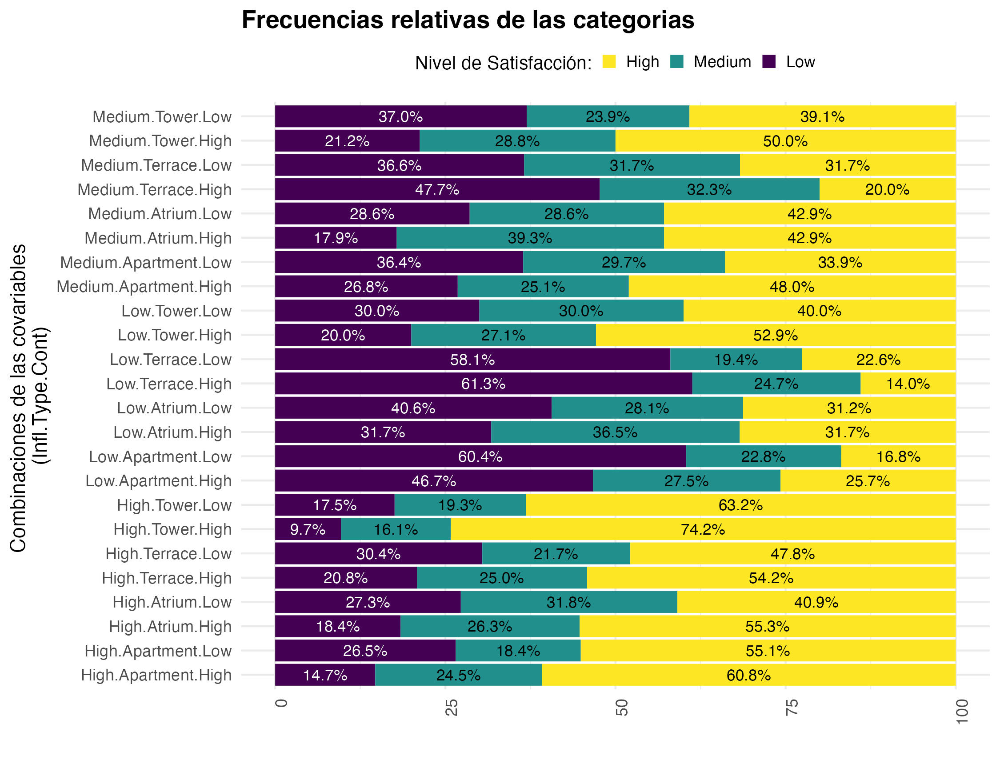
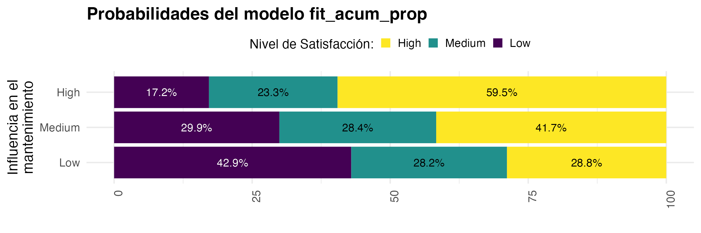

```{r, include=FALSE, echo=FALSE, warning=FALSE}
# Establecer directorio de la sesión
# Saltar si no es necesario
```

```{r setup, include=FALSE}
#Limpieza del environment
rm(list = ls(all.names = TRUE))
gc()

# Configuración global de los bloques de código (chunk's)
knitr::opts_chunk$set(
	echo = FALSE,
	fig.align = "center",
	fig.dim = c(6.0, 5.0),
	fig.pos = "H",
#Agregamos configuraciones para evitar mensajes de advertencias y de errores en el archivo
	message = FALSE,
	warning = FALSE,
	error = F
)

# Paquetes a usar
library(multcomp)
library(DHARMa)
library(ggResidpanel)
library(ggplot2)
library(broom)
library(MASS)
library(car)
library(VGAM)
library(lessR)
library(tidyverse)
library(plotly)     
library(kableExtra)
library(gridExtra)
```

```{=tex}
\begin{center}
  {\large \textbf{5. Modelos lineales generalizados para datos categóricos}}
\end{center}
```
La base de datos \textit{Preg5.csv} contiene información sobre el nivel de satisfacción (Sat) de un conjunto de individuos que rentan una vivienda. El interés es identificar si entre los factores que definen este nivel están: el tipo de vivienda (Type), la percepción sobre su influencia en las decisiones sobre el mantenimiento de la vivienda (Infl) y el contacto que tienen con el resto de inquilinos (Cont).

```{=tex}
\setcounter{figure}{17}
\setcounter{table}{12}
```
\textbf{i) Gráfica de frecuencias relativas.}

```{r, include=FALSE, echo=FALSE, warning=FALSE}
# Cargamos el archivo con los datos
datos5 <- read.csv('Preg5.csv')
# Vemos su estructura
str(datos5)
# Dado que las variables son categóricas hacemos un pre-procesamiento convirtiendolas a tipo factor y alineamos los niveles de las variables Sat, Infl y Cont para que las categorias esten en orden (de menor a mayor) "Low", "Medium", "High"
datos5$Sat <- factor(datos5$Sat, levels = c("Low", "Medium", "High"))
datos5$Infl <- factor(datos5$Infl, levels = c("Low", "Medium", "High"))
datos5$Type <- factor(datos5$Type)
datos5$Cont <- factor(datos5$Cont, levels = c("Low", "High"))

# Creamos una nueva variable para concatenar las categorias de Infl, Type y Cont
datos5$Infl.Type.Cont <- factor(paste(datos5$Infl, datos5$Type, datos5$Cont, sep="."))
```

Una vez cargados los datos, se agregó una variable adicional en la que se describen las posibles combinaciones de las categorias de Infl \textit{(Low, Medium, High)}, Type \textit{(Apartment, Atrium, Terrace, Tower)} y Cont \textit{(Low, High)}. En el cuadro \@ref(tab:Datos5) se presenta una muestra aleatoria de los datos para observar su estructura de acuerdo a las categorias.

```{r Datos5, include=TRUE, echo=FALSE, warning=FALSE}
set.seed(9)
# Generamos un head aleatorio de los datos
datos5 %>% sample_n(5) %>% 
  kable(booktabs = T, 
        align = "c", 
        linesep = "", 
        caption = "Muestra aleatoria de los datos Preg5.csv") %>%
  kable_styling(latex_options = "HOLD_position")
```

Para representar visualmente esta información, en la figura \@ref(fig:BarChart1) se muestra un gráfico de barras con las frecuencias relativas correspondientes a cada grupo de categorias.

```{r BarChart1aux, include=FALSE, echo=FALSE, warning=FALSE, fig.cap="BarChart: Distribución del nivel de satisfacción por cada grupo de individuos."}
#Guardamos en un dataframe auxiliar los conteos y frecuencias de cada grupo de categorias
aux <- datos5 %>%
    group_by(Infl.Type.Cont, Sat) %>%
    summarise(n = n()) %>%
    mutate(freq = n*100 / sum(n)) 

aux$Sat <- factor(aux$Sat, levels = c("High", "Medium", "Low"))

# Crear la gráfica de barras
f1 <- ggplot(aux, aes(x = factor(Infl.Type.Cont), y = freq, fill = Sat)) +
  geom_bar(stat = "identity") + scale_fill_viridis_d(direction = -1) +
  geom_text(aes(label = sprintf("%.1f%%", freq)), 
            position = position_stack(vjust = 0.5), size = 3) +
  geom_text(data = subset(aux, Sat=="Low"),
            aes(label = sprintf("%.1f%%", freq)), 
            position = position_stack(vjust = 0.5), size = 3,
            colour = "white") +
  labs(
    title = "Frecuencias relativas de las categorias",
    x = "Combinaciones de las covariables \n(Infl.Type.Cont)",
    y = ""
  ) +
  theme_minimal() +
  theme(
    axis.text.x = element_text(angle = 90, hjust = 1),
    legend.position = "top",
    plot.title = element_text(face = "bold"),
    legend.key.size = unit(0.3, "cm"),  # Tamaño de los cuadros de color
    legend.title = element_text(size = 10)
  ) + guides(fill = guide_legend(title = "Nivel de Satisfacción:")) +
  coord_flip()
```

```{r BarChart1, echo=FALSE, warning=FALSE, fig.cap="BarChart: Distribución del nivel de satisfacción por cada grupo de individuos."}
# Se guarda la imagen con las medidas especificadas
ggsave("frecuencias_Ej5.png", f1, width = 7.5, height = 5.7)
# Se incluye la imagen del gráfico en el pdf generado

#Una disculpa por hacerlo así, fue la única forma en que pude modificar el tamaño de las gráficas
```

En esta gráfica se observa que los grupos que tienen un mayor porcentaje de individuos con alta satisfacción, tienen en común una alta influencia en las decisiones del mantenimiento de la vivienda. De igual manera en las categorias donde abundan los individuos con un nivel de satisfacción bajo, tienen en común un nivel bajo también en su influencia en el mantenimiento. Por lo tanto, se puede deducir que la variable Infl, es considerablemente importante en la satisfacción final del arrendatario.

\textbf{ii) Ajuste de modelos logísticos multinomiales}

Debido a que se está tratando con variables categóricas, se utilizará la función $vglm()$ de la paquetería VGAM en la cuál se pueden ajustar modelos lineales generalizados con distribución multinomial.

Sabiendo que los niveles categóricos de la variable Sat están en el orden \textit{Low, Medium, High}, se escogió el nivel de referencia como "Low" al ajustar los modelos.

```{r, include=FALSE, echo=FALSE, warning=FALSE}
levels(datos5$Sat)
```

```{r, include=TRUE, echo=TRUE, warning=FALSE}
# Modelo con interacciones (nivel de referencia "Low")
fit_int <- VGAM::vglm(formula =  Sat ~ Infl*Type*Cont, family = multinomial(refLevel = "Low"), 
                      data = datos5)
# Modelo sin interacciones (nivel de referencia "Low")
fit_red <- VGAM::vglm(formula = Sat ~ Infl+Type+Cont, family = multinomial(refLevel = "Low"), 
                      data = datos5)
```

```{r, include=FALSE, echo=FALSE, warning=FALSE}
# Coeficientes betas de los modelos
coef(fit_int, matrix=TRUE) 
coef(fit_red, matrix=TRUE)
```

En el Cuadro \@ref(tab:PruebaLRT1) se muestran los resultados de la prueba de hipótesis (test $LRT$) en la que se analiza si es plausible utilizar el modelo reducido sobre el modelo completo: $$H_0: \text{Modelo reducido}\;\text{ vs. }\; H_a: \text{Modelo completo}$$

```{r PruebaLRT1, include=TRUE, echo=FALSE, warning=FALSE}
# Prueba para seleccionar modelo
anova(fit_red, fit_int, test = "LRT", type = "I") %>% 
  kable(booktabs = T, 
        align = "c", 
        linesep = "", 
        caption = "Analysis of Deviance Table") %>%
  kable_styling(latex_options = "HOLD_position")
```

Como se observa en el resultado, el $p$-value ($p=0.267$) es mayor a un nivel de significancia de $\alpha=0.05$. Por lo tanto, no se rechaza la hipótesis nula y podemos considerar como bueno el modelo reducido con un $95\%$ de confianza.

Por otro lado, en el cuadro \@ref(tab:comp1) se muestran los puntajes obtenidos al calcular el AIC y BIC para cada modelo.

```{r comp1, include=TRUE, echo=FALSE, warning=FALSE}
# Se crea dataframe con el valor de los AIC y BIC para compararlos directamente
comparacion_AIC_BIC1 <- data.frame(
AIC = c(AIC(fit_red), AIC(fit_int)),
BIC = c(BIC(fit_red), BIC(fit_int)) )

row.names(comparacion_AIC_BIC1) <- c("fit_red", "fit_int")
  
kable(comparacion_AIC_BIC1, booktabs = T, 
        align = "c", 
        linesep = "", 
        caption = "Puntajes de AIC y BIC para ambos modelos") %>% 
  kable_styling(latex_options = "HOLD_position")
```

Esto nos ayuda a confirmar que el modelo reducido describe mejor el comportamiento de los datos, pues en ambas medidas tiene un puntaje menor.

\textbf{iii) Ajuste de modelos logísticos multinomiales acumulativos}

Hasta ahora, el análisis realizado se hizo considerando que la variable dependiente $Sat$ es nominal, pero como además es una variable ordinal, se pueden ajustar modelos logísticos acumulativos.

```{r, include=TRUE, echo=TRUE, warning=FALSE}
# Modelos acumulativo sin supuesto de proporcionalidad
fit_acum <- VGAM::vglm(formula =  Sat ~ Infl+Type+Cont, family = cumulative(parallel = FALSE),
                     data = datos5)
# Modelos acumulativo con supuesto de proporcionalidad
fit_acum_prop <- VGAM::vglm(formula = Sat ~ Infl+Type+Cont, family = cumulative(parallel = TRUE),
                      data = datos5)
```

```{r, include=FALSE, echo=FALSE, warning=FALSE}
# Coeficientes betas de los modelos acumulativos
coef(fit_acum, matrix=TRUE)
coef(fit_acum_prop, matrix=TRUE)
```

De la misma forma en que se hizo en el inciso ii, en el cuadro \@ref(tab:PruebaLRT2) se muestra el resultado de la prueba de hipótesis en la que se comparan ambos modelos.

```{r PruebaLRT2, include=TRUE, echo=FALSE, warning=FALSE}
# Prueba para seleccionar modelo acumulativo
anova(fit_acum_prop, fit_acum, test = "LRT", type = "I") %>% 
  kable(booktabs = T, 
        align = "c", 
        linesep = "", 
        caption = "Analysis of Deviance Table") %>%
  kable_styling(latex_options = "HOLD_position")

```

Como se observa en el resultado, el $p$-value ($p=0.199$) es mayor a un nivel de significancia de $\alpha=0.05$. Por lo tanto, no hay evidencia para rechazar la hipótesis nula y podemos considerar como bueno el modelo reducido (bajo el supuesto de proporcionalidad). Al calcular los puntajes de AIC y BIC para cada modelo, se obtiene lo que se presenta en el cuadro \@ref(tab:comp2).

```{r comp2, include=TRUE, echo=FALSE, warning=FALSE}
# Dataframe para comparar coeficientes AIC y BIC
comparacion_AIC_BIC2 <- data.frame(
AIC = c(AIC(fit_acum_prop), AIC(fit_acum)),
BIC = c(BIC(fit_acum_prop), BIC(fit_acum)) )

row.names(comparacion_AIC_BIC2) <- c("fit_acum_prop", "fit_acum")
  
kable(comparacion_AIC_BIC2, booktabs = T, 
        align = "c", 
        linesep = "", 
        caption = "Puntajes de AIC y BIC para ambos modelos") %>% kable_styling(latex_options = "HOLD_position")
```

Esto nos ayuda a confirmar que el modelo bajo el supuesto de proporcionalidad ($fit\_acum\_prop$) describe mejor el comportamiento de los datos pues sus puntajes fueron menores al del modelo $fit\_acum$.

\textbf{iv) Selección de modelo e interpretación de resultados}

Como se observa en los cuadros \@ref(tab:comp1) y \@ref(tab:comp2), tanto el AIC como el BIC indican que el modelo $fit\_acum\_prop$ es más adecuado a los datos que el modelo $fit\_red$.

El modelo acumulativo proporcional se describe explícitamente de la siguiente manera: $$logit\left[\mathbb{P}(Sat\leq j)\right]=\beta_0^{(j)}+\beta_1I_{Medium}+\beta_2I_{High}+\beta_3T_{Atrium}+\beta_4T_{Terrace}+\beta_5T_{Tower}+\beta_6C_{High}$$ Para $j=1,2$, donde 1 corresponde al nivel "Low", y 2 a "Medium". El valor estimado para cada coeficiente $\beta_i$ se encuentra en el cuadro \@ref(tab:betas), donde sólo el asociado a $\beta_0$ (Intercept) cuenta con dos valores distintos, según la categoria correspondiente.

```{r betas, include=TRUE, echo=FALSE, warning=FALSE}
# Estimación de los coeficientes betas del modelo
coef(fit_acum_prop, matrix=TRUE) %>% 
  kable(booktabs = T, 
        align = "c", 
        linesep = "", 
        caption = "Estimación de los coeficientes betas del modelo.") %>%
  kable_styling(latex_options = "HOLD_position")

```

```{r, include=FALSE, echo=FALSE, warning=FALSE}
# Filtramos los grupos de categorias por aquellos que tengan Type="Apartment" y Cont="High"
combinaciones <- unique(subset(subset(datos5[,3:5], Type=="Apartment"), Cont=="High"))
# Ahora con la función predict de tipo "response", podemos obtener las probabilidades
probas <- predict(fit_acum_prop, combinaciones, type = "response")
# Guardamos en un dataframe los grupos de categorias con sus probabilidades
datos_modelo <- bind_cols(combinaciones, probas)
# Se despliega el dataframe anterior (datos_modelo) para tener cada probabilidad en un renglon
data_long <- datos_modelo %>% 
    pivot_longer(cols = unique(datos5[,2]), 
                 names_to = "Respuesta", 
                 values_to = "Probabilidad")

# Para mostrar las probas en porcentajes
data_long$Probabilidad <- data_long$Probabilidad *100
```

En la figura \@ref(fig:BarChart2) se muestran las probabilidades de que el modelo prediga cada nivel de satisfacción (de forma acumulativa) únicamente para los grupos de individuos bajo la restricción $Type$="Apartment" y $Cont$="High".

```{r BarChart2aux, include=FALSE, echo=FALSE, warning=FALSE, fig.cap="Comparación de los resultados del modelo con las proporciones observadas en los datos."}
# Especificamos el orden de los niveles
data_long$Respuesta <- factor(data_long$Respuesta, levels = c("High", "Medium", "Low"))

# Crear la gráfica de barras de las porbabilidades
g1 <- ggplot(data_long, aes(x = factor(Infl), y = Probabilidad, fill = Respuesta)) + geom_bar(stat = "identity") + scale_fill_viridis_d(direction = -1) +
  geom_text(aes(label = sprintf("%.1f%%", Probabilidad)), 
            position = position_stack(vjust = 0.5), size = 3) +
  geom_text(data = subset(data_long, Respuesta=="Low"),
            aes(label = sprintf("%.1f%%", Probabilidad)), 
            position = position_stack(vjust = 0.5), size = 3,
            colour = "white") +
  labs(
    title = "Probabilidades del modelo fit_acum_prop",
    x = "Influencia en el\nmantenimiento",
    y = ""
  ) +
  theme_minimal() +
  theme(
    axis.text.x = element_text(angle = 90, hjust = 1),
    legend.position = "top",
    plot.title = element_text(face = "bold"),
    legend.key.size = unit(0.3, "cm"),  # Tamaño de los cuadros de color
    legend.title = element_text(size = 10)
  ) + guides(fill = guide_legend(title = "Nivel de Satisfacción:")) + coord_flip()
```

```{r BarChart2, include=TRUE, echo=FALSE, warning=FALSE, fig.cap=" Resultados del modelo para los grupos con $Type$=``Apartment'' y $Cont$=``High''."}
# Se guarda la imagen de la gráfica con las dimensiones especificadas
ggsave("probas2_Ej5.png", g1, width = 7.5, height = 2.5)
# Se muestra la imagen en el pdf

```

Haciendo una comparación directa entre estos resultados del modelo y el comportamiento de los datos observado en la figura \@ref(fig:BarChart1) es posible notar que particularmente para este grupo de individuos las probabilidades predichas por el modelo son bastante similares a las frecuencias relativas de los datos. Esto indica que la suposición que se tenía de que la variable Infl es bastante influyente en el nivel de satisfacción era acertada, ya que como se observa, a mayor nivel en la variable de influencia en el mantenimiento, la probabilidad de satisfacción alta es mayor.
